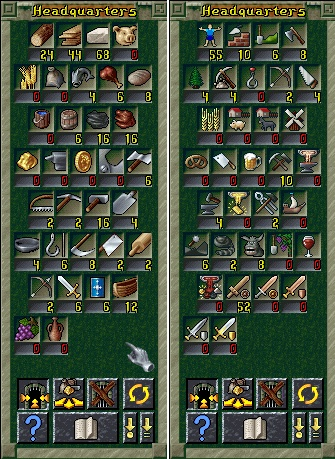
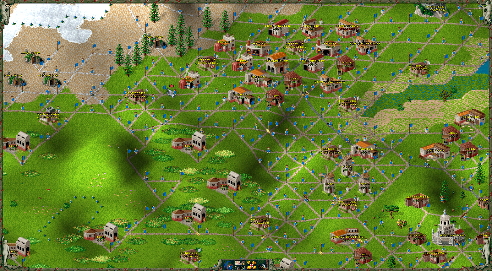
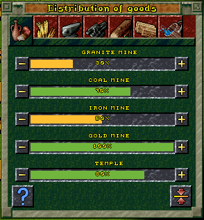
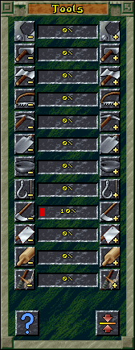
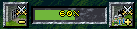
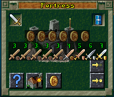

# S25 Strategy

(This page has some large gif's that may take some time to load... idk what the better way to embed here is).

My take on general strategies and tips for Settlers 2 (RTTR). Mainly things I don't feel are super obvious and are never explained by the game.

Sorry if anything here it wrong, some of it prob is xD

## General

### Starting Tips

For when the game first starts with  `goods at start == normal`:

The opening to the game is probably the most crucial part. How quickly can you capture important land with mines and get food/weapons/coins operating? The more efficient you can be in the opening the larger your advantage when you meet your first enemy on the map.

This is also the most subjective part and deffs is more about how you like to play / what works for you. This is just some general things I like to do at the start of a new game.

Still working on my strategy here.... tbc but general thoughts

* Expanding quickly and getting access to mines is top priority.
* Initial expansions should be via barracks as they build quicker and only required 2 wood.
* 3 Sawmills seems to be ideal for small-medium maps
* You can delay building a quarry initially as starting stone is quite adequate.
* Prioritize fishery's as primary source of food initially.
* Don't commit to many buildings to construction, keep an eye on resources and build as you have free resources so you can have better control of the order of construction.

### Building Layout (GRID)

Somehow I never realized this, but S2 is played on a grid. Seems so obvious now but oh well. If you use the grid properly you can have much much better connected roads and get more buildings placed down. Using the grid system almost guarantees you wont get road blocks (something I used to get a lot off).

* Gird allows small and medium buildings to be placed in between the roads.
* Large buildings will take up more space than the grid allows and need to be built around a bit.
* Grid should always be used where possible.
* Hills do mess up the grid in terms of buildings being possible, in this case I like to just put a bunch of random extra roads for the lols.

## Economy

### Distribution of Goods

Generally I think the default settings here are good and only really need to be tweaked situationally based on your economy during the game.

The only one I change at the start of a game is food distribution. I like to switch coal(50%)/iron(70%) to coal(70%)/iron(50%). 

There is no option to set priority for stone. My observation is that stone will prioritize catapult ammo over construction. Breaking roads to Catapults is the only way to prioritize construction afaik.

### Metalworks / Making Tools

Its good to be very deliberate about what tools you want to make. Only make the exact amount you need as the rest of your iron should be going to making soldiers. Set all tools to 0% production except for the tool you specifically want to make:

If you watch the resources in the Metalworks, the second resources are consumed, you can hit `Production == Off` and the Metalworks will complete the current tool then stop working.

### Resource Allocations

#### How Resource Slots in Buildings Work

This refers to the way resources are allocated to buildings. If a resource is in transit to a building it is considered allocated. This means the resource slot in the building is accounted for and will not have additional resources allocated. This is prob best explained via example:

* Lets say you have a Coal Mine with no bread. Mines can take 2 bread.
* Your HQ is far away from your mine but has lots of spare bread.
* Bread is taken out of your HQ and allocated to bread slot 1 in your mine.
* Bread is taken out of your HQ and allocated to bread slot 2 in your mine.
* 2 Bread is on roads and in transit to your Coal Mine.
* Your bakery which is next to your Coal Mine produces a piece of bread.
* Rather then send this bread to the coal mine, it is sent to the storage in the HQ as both the empty bread slots in the Coal Mine are already allocated to bread in transit.
* This means your Coal Mine is sitting idle longer than it needs to be. A storehouse near the bakery/Coal Mine would boost your economy's efficiency.

This is unlikely to matter on smaller maps. But good to be aware off. If you have for instance lots of bread, but your mines are unable to run at 100% it is probably because of this. Creating a storehouse near the mines and re-directing spare bread to that storehouse solves this.

This is especially noticeable on ship maps, where allocated resources could be in transit on a ship for minutes at a time.

#### How Resources are allocated For Construction

This refers to how Wood and Stone are prioritized between buildings under construction. This works based on order of building construction request. I suspect internally there is a stack / list of building that is appended to when a new building is placed for construction. When wood or stone is being allocated to construction the first building in the list will get the allocation. Distance between Sawmill/Quarry/HQ and construction site does not matter.

Results of testing:

* You have 0 wood left in stock.
* you have sawmills producing wood.
* You have placed 10 buildings for construction.
* When a sawmill produces wood that wood will be allocated to the building ordered for construction FIRST.
* Once that building has the required wood allocated the building ordered for construction NEXT will be allocated the wood.
* There are instances where if you have multiple sawmills, SAWMILL 1 may allocate wood to FIRST building and SAWMILL 2 will allocate to SECOND building. But multiple can allocate to FIRST if the building required lots of wood like a watchtower etc.
* There seems to be very occasional instances where a military building can skip the queue and be prioritized, this seems to happen at random??
* If you break the road to building FIRST, then no wood will be allocated and wood will go to SECOND. However if you reconnect the road to FIRST when SECOND has half its wood allocated, wood will start to priorities FIRST again. This means the order is based on the time the building is placed for construction, NOT the time a building is connected to the road network.

#### How Resources are allocated For General Production

This refers to resource allocation to building that are constructed and required goods to operate. This is specifically for instances where multiple buildings need the same resource and have an equal distribution of goods for the required resource. First priority will go to the building with the lowest current allocation (including allocations in transit), if equal allocations between multiple buildings the closest building will be prioritized.

### Food Production

* Fish are absolutely the best source of food in the game. They are cheap and quick to get. Early game if you have access to water, get as much fish production as you can. This can get your mines working well and delay the need to invest in more costly food production.
* Hunters are the second best source of food in the game for the same reason as fishery's. Forests will spawn animals, so if you have land you wont be using, build a forester to create a forest, so you can have a hunter constantly running there.
* Next up is Bakery's. This is much more costly to get running as you need expensive and large buildings. However it is an infinite source of food.
* Last up if pigs. This ranks slightly below Bread as the required buildings are slightly more expensive to build. This is also an infinite source of food.
* Ideally you want to have both bakery's and Pig Farms operating so you are creating infinite bread and meat. This is due to mines only being able to take 2 of each food type at a time, this means providing multiple types of food will make it easier to have mines running efficiently.

### Building placements

This plays into the resource allocations and available resource slots in a buildings as well. The main 2 recommendations here are:

* For Bread production. Build mills, farms and wells wherever you have ok land. Mills have 6 slots for wheat so long travel times are ok. Build you bakery's as close to your mines as possible (even blow them up and relocate them as your mines exhaust and move). Bakery can be far from well and mill as it have 6 slots for flour and water. But should be near mines as they only have 2 slots for bread.
* For Meat / Slaughterhouse. The same is true, where the farm, pig farm and well can be wherever land is available. But the slaughterhouse itself should be as close as possible to your mines.

### Donkey Breeder

Not sure how valuable this is when you have a grid layout with roads that are already efficient? For now I am treating this as a mid-late game luxury once I have a steady food supply going.

### Moving Soldiers and Workers

You can move solders / workers / donkey's / etc between HQ and Storehouses with the `take out of store` command. I think this did not work in S2 Gold? But works in RTTR. Useful for moving soldiers / workers between storehouses to get soldiers to frontline sooner etc. There has to be a storehouse within a certain range (how far?) for them to move to or this will not work.

## Military

### Military Sliders

| Slider                             | Name                 | Usage / Strategy                                                                         |
| ---------------------------------- | -------------------- | ---------------------------------------------------------------------------------------- |
|  | More/Less Recruits   | Dunno, I have never changed this.                                                        |
|  | Weak/Strong Defense  | Determine what strength soldiers will leave storage to occupy military buildings. Also determines which soldiers will leave a military building to meet enemy attackers on the field. This slider is important for optimal coin usage explained later.         |
|  | Fewer/More Defenders | Dunno, I have never changed this.                                                        |
|  | Less/More Attackers  | This is super important, I always max it out. Means you can attack even from a barracks. This does however allow you to attack to the point of only have 1 solder left in a building making it vulnerable for capture / catapult destruction.                      |
|  | Interior             | This is for plain white flag buildings (No enemy nearby).                                |
|  | Center of Country    | This is for half flag buildings (Kinda near enemy but not really).                       |
|  | Near Harbour Points  | Dunno, I have never changed this.                                                        |
|  | Border Areas         | This is for full flag buildings (bordering enemy territory). Change from max at your own risk xD                                                                                                                                                     |

### Soldier Strength

> [!WARNING]
> I am fairly sure this is wrong. The HP calculations are correct. But Stronger Solders may also have a damage bonus or other things? I feel like a general is more than 2.33x a private right???.
> It looks like only HP based on the military consts file in the RTTR source code - https://github.com/Return-To-The-Roots/s25client/blob/master/libs/s25main/gameData/MilitaryConsts.h
> .... IDK maybe this is right???

* Soldier strength is based on HP and chance to hit/
* Each promotion adds 1 HP and an unknown chance to hit.
* A General is 7x stronger than a Private (I THINK).
* Soldiers DO NOT heal immediately when re-entering a building (They did in S2 Gold AFAIK). They take time to heal in RTTR (idk how long).

Doing some tacking of battles between privates and Generals to check hit rates...
This is a low sample size and needs more observations. But its better than nothing for now.

| Soldier | Battle 1 | Battle 2 |
| --------| -------- | -------- |
| Private | 9        | 9        |
| General | 27       | 27       |

* This means general hit chance 3x private hit chance.
* Calculated on HP this means a general has 3x effective HP (EHP).

Assuming a linear increase in hit chance like HP increase is the following table **should** be accurate.

| Rank                | HP | Hit Chance vs Private | EHP vs Private | Strength vs Private |  
| ------------------- | -- | --------------------- | -------------- | ------------------- |
| Private             | 3  | 1x                    | 3              | 1x                  |
| Private First Class | 4  | 1.5x                  | 6              | 2x                  |
| Sergeant            | 5  | 2x                    | 10             | 3.3x                |
| Officer             | 6  | 2.5x                  | 15             | 5x                  |
| General             | 7  | 3x                    | 21             | 7x                  |

### Efficient Gold Coin Usage

* Military Strength is measured by total HP of all soldiers.
* A poorly used coin will increase military strength by 1.
* An optimally used coin will increase military strength by 4.
* To ensure you can get +4 on coins used you should:
    * Have a Fortress (or watchtower) near mint(s).
    * Set the Military Slider for Weak/Strong defense to 0%.
    * Max out the soldiers in the fortress by setting military slider Interior to max (or appropriate one for fortress position).
    * Allow coins only to this fortress.
    * When a soldier is promoted to a General drop the interior setting the number of steps == to generals in fortress.
    * That amount of generals will leave the fortress (generals leave not privates due to weak/strong defence set to 0%).
    * Once generals have left the fortress increase the interior slider back to 100% and the weakest soldiers from the nearest storehouse will replace the generals.
* Using this method means you can make optimal use of Gold Coins without having to cycle all soldiers from buildings leaving you with a temporary vulnerability.
* Video of this in action... Rinse and repeat until all Privates are Generals.

### Destroying Redundant Military Buildings

If you are careful about it you can destroy military buildings used to expand once their territory control overlaps. This gives you soldiers back into your main army.

## Misc

* Mines will mine a much larger area around them then I thought.
* Disconnecting roads from most military buildings as you expand is a good idea, so extra soldiers are not in transit and wasted when manipulating soldier allocations etc.
* Get in the habit of setting `Gold Delivery == X` on every military building as soon as its built.

## Appendix

### Buildings

Mostly here because I always have to look up what tools diff building require. To be completed...

| Building      | Size   | Build    | Worker     | Tool         | Requires         | Produces | Ratios                         | Other Tips                                      |
| ------------- | ------ | ---------| ---------- | ------------ | ---------------- | -------- | ------------------------------ | ----------------------------------------------- |
| Woodcutter    | Small  | 2xW      | Woodcutter | Axe          | Nearby Trees     | Logs     | 2x for each Sawmill + Forester | N/A                                             |
| Forester      | Small  | 2xW      | Ranger     | Shovel       | Nearby Space     | Tree     | 1x per 2 woodcutters           | Making forests will spawn animals for hunters   |
| Quarry        | Small  | 2xW      | Stonesman  | Pick-axe     | Nearby Stone     | Stone    | N/A                            | N/A                                             |
| Fishery       | Small  | 2xW      | Fisher     | Rod and Line | Water            | Fish     | N/A                            | Most cost effective food source in the game     |
| Hunter        | Small  | 2xW      | Huntsman   | Bow          | Animals / Forest | Meat     | 1 hunter per forest            | N/A                                             |
| Barracks      | Small  | 2xW      | N/A        | N/A          | N/A              | N/A      |                                | Expands border by 7 intersections               |
| Guardhouse    | Small  | 2xW, 3xS | N/A        | N/A          | N/A              | N/A      |                                | Expands border by 8 intersections               |
| Lookout Tower | Small  | 4xW      | Scout      | N/A          | N/A              | N/A      | N/A                            | Unable to create more scouts that start with??? |
| Well          | Small  | 2xW      | N/A        | N/A          | N/A              | Water    | 1 per building requiring water | N/A                                             |
| ----          | Medium |          |            |              |                  |          |                                |                                                 |
| ----          | Large | | | | | | | |
