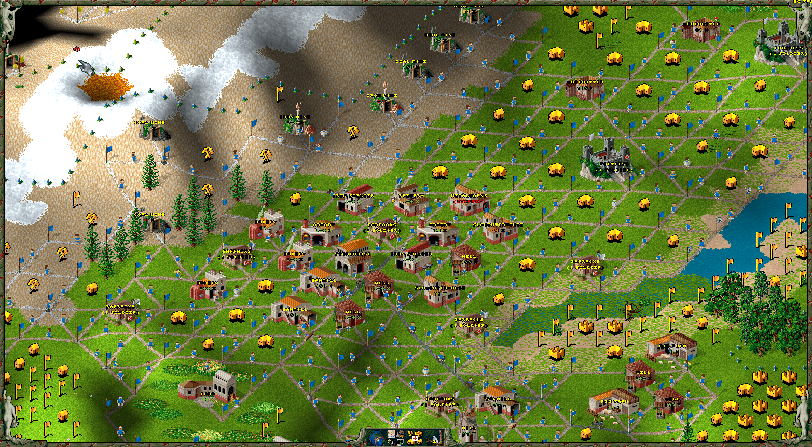

# S25 Strategy

My take on general strategies and tips for Settlers 2 (RTTR). Mainly things I don't feel are super obvious and are never explained by the game.

## General

### Starting Tips

For when the game first starts with  `goods at start == normal`:

* 1
* 2
* 3

### Building Layout (GRID)

Somehow I never realized this, but S2 is played on a grid. Seems so obvious now but oh well. If you use the grid properly you can have much much better connected roads and get more buildings placed down. Using the grid system almost guarantees you wont get road blocks (something I used to get a lot off).

* Gird allows small and medium buildings to be placed in between the roads.
* Large buildings will take up more space than the grid allows and need to be built around a bit.
* Grid should always be used where possible.
* Hills do mess up the grid in terms of buildings being possible, in this case I like to just put a bunch of random extra roads for the lols.

## Economy

### Distribution of Goods

Generally I think the default settings here are good and only really need to be tweaked situationally based on your economy during the game.

The only one I change at the start of a game is food distribution. I like to switch coal(50%)/iron(70%) to coal(70%)/iron(50%). 

* There is no option to set priority for stone. My observation is that stone will prioritize catapult ammo over construction. Breaking roads to Catapults is the only way to priorities construction afaik.

### Transport

### Metalworks / Making Tools

### Resource Allocations

### Food Production

### Building placements

### Donkey Breeder

### Moving Soldiers and Workers

You can move solders / workers / donkey's / etc between HQ and Storehouses with the `take out of store` command. I think this did not work in S2 Gold? But works in RTTR. Useful for moving soldiers / workers between storehouses to get soldiers to frontline sooner etc.

## Military

### Military Sliders

<!-- ### Defender Strengths

### More Attackers

### Soldier Allocations -->

### Soldier Strength

* Soldier strength is determined entirely by their HP (I THINK). 
* Each promotion adds 1 HP. 
* A General is 2.33x stronger than a Private (I THINK).
* Soldiers DO NO heal immediately when re-entering a building (They did in S2 Gold AFAIK). They take time to heal in RTTR (idk how long).

| Rank                | HP | vs Private |  
| ------------------- | -- | ---------- |
| Private             | 3  | 1x         |
| Private First Class | 4  | 1.33x      |
| Sergeant            | 5  | 1.66x      |
| Officer             | 6  | 2x         |
| General             | 7  | 2.33x      |

### Efficient Gold Coin Usage

<video src="assets/coin-usage.mp4" controls></video>

+1 for bad usage. +4 for best usage

### Destroying Redundant Buildings

## Misc

* Mines will mine a much larger area around them then I thought.
* Disconnecting roads from most military buildings as you expand is a good idea, so extra soldiers are not in transit and wasted when manipulating soldier allocations etc.
* Get in the habit of setting `Gold Delivery == X` on every military building as soon as its built.

## Appendix

### Buildings

Appendix of buildings and some misc tips. Mostly here because I always have to look up what tools diff building require.

| Building   | Size  | To Build  | Worker     | Tool | Resources Required | Resources Produced | Ratios                         | Other Tips |
| ---------- | ----- | ----------| ---------- | ---- | ------------------ | ------------------ | ------------------------------ | ---------- |
| Woodcutter | Small | 2xW, 0xS  | Woodcutter | Axe  | Nearby Trees       | Logs               | 2x for each Sawmill + Forester | N/A        |
| TBC    | | | | | | | |
